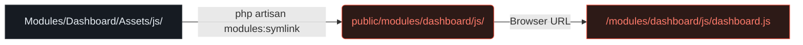

<div align="center">

# 🎨 Laravel Module Assets

**A zero-dependency Artisan command that solves the modular asset problem in Laravel.**

[](https://laravel.com)
[](https://php.net)
[](#-testing)
[](#-license)

Keep your JavaScript and CSS files **inside each module** and make them instantly web-accessible — no build tools, no copying, no config.

[**Explore the Interactive Manual**](https://github.com/ibraheem9/laravel-module-assets)

---

</div>

## 🚨 The Problem

When building large Laravel applications, developers often adopt a modular architecture. However, managing assets in this architecture presents a significant challenge:

<table>
<tr>
<td width="50%">

### ❌ Without This Solution
- Assets must be manually copied to `public/`
- Modules are not truly self-contained
- Easy to forget copying on deploy
- Stale files accumulate in `public/`
- Removing a module leaves orphaned files

</td>
<td width="50%">

### ✅ With This Solution
- Assets stay inside their module directory
- One command creates all symlinks instantly
- Edit files — changes reflect immediately
- Delete a module — symlink breaks cleanly
- No build step required for plain JS/CSS

</td>
</tr>
</table>

> 💡 **How it works:** A symbolic link is a file system pointer. The web server sees files in `public/modules/` — but they physically live inside each module. Editing the source file is instantly reflected in the browser.

---

## ⚙️ How It Works

The command scans your `Modules/` directory and creates a symbolic link for each asset subdirectory into `public/modules/`.



---

## 🚀 Installation & Usage

Follow these steps to add the module asset system to any existing Laravel project.

### 1️⃣ Copy the Command File
Place `CreateModuleSymlinks.php` into `app/Console/Commands/`.

### 2️⃣ Register the Modules Namespace
Add `Modules\\` to your `composer.json` autoload, then run `composer dump-autoload`.

```json
"autoload": {
    "psr-4": {
        "App\\": "app/",
        "Modules\\": "Modules/"
    }
}
```

### 3️⃣ Create Your Module Structure
Create the `Modules/` directory at the project root with your module's `Assets/` subdirectories.

```bash
mkdir -p Modules/Dashboard/Assets/{js,css,images}
```

### 4️⃣ Run the Command
Execute the Artisan command. It scans all modules and creates the symlinks automatically.

```bash
php artisan modules:symlink
```

<div align="center">
  
</div>

---

## 📁 Module Structure

The `Assets/` directory is the only required convention. Any subdirectory inside it becomes a symlink.

```text
Modules/
└── Dashboard/
    └── Assets/          ← only this is required
        ├── js/
        │   └── dashboard.js
        └── css/
            └── dashboard.css
```

**Result in `public/`:**
```text
public/
└── modules/
    └── dashboard/           ← created by command
        ├── js/      → symlink to Modules/Dashboard/Assets/js/
        └── css/     → symlink to Modules/Dashboard/Assets/css/
```

---

## 🛠️ Asset Helper Class

An optional helper providing a clean API for referencing module assets in views.

```php
// Single JS file URL
\App\Helpers\ModuleAssetHelper::js('dashboard', 'dashboard.js');
// → /modules/dashboard/js/dashboard.js

// Single CSS file URL
\App\Helpers\ModuleAssetHelper::css('analytics', 'analytics.css');
// → /modules/analytics/css/analytics.css

// All JS files for a module
\App\Helpers\ModuleAssetHelper::getJsAssets('dashboard');
// → ['/modules/dashboard/js/dashboard.js']

// Or use Laravel's asset() directly:
asset('modules/dashboard/js/dashboard.js');
```

---

## 📊 Approach Comparison

How this solution compares to other common approaches for managing assets in modular Laravel applications.

| Approach | Module Isolation | No Build Step | Auto-update on Edit | Deploy Complexity | Dependencies |
|----------|-----------------|---------------|---------------------|-------------------|--------------|
| **🔗 modules:symlink (This)** | 🟢 Full | 🟢 Yes | 🟢 Instant | 🟢 1 command | 🟢 None |
| Store assets in `public/` | 🔴 None | 🟢 Yes | 🟢 Yes | 🟢 None | 🟢 None |
| Copy assets on deploy | 🟡 Partial | 🟢 Yes | 🔴 Manual | 🔴 Script needed | 🟢 None |
| Vite per-module config | 🟢 Full | 🔴 Build required | 🔴 Rebuild needed | 🔴 Complex | 🔴 Node.js + Vite |
| nwidart/laravel-modules | 🟢 Full | 🟡 Partial | 🟡 Depends | 🟡 Medium | 🔴 Heavy package |

---

## ✅ Testing

15 PHPUnit feature tests covering all scenarios. All tests pass.

```bash
$ php artisan test tests/Feature/CreateModuleSymlinksTest.php

   PASS  Tests\Feature\CreateModuleSymlinksTest
  ✓ command creates symlinks for modules                  0.13s
  ✓ symlinks point to correct directories                 0.01s
  ✓ command handles missing assets directory              0.01s
  ✓ command removes existing symlinks                    0.01s
  ✓ asset files are accessible through symlinks          0.01s
  ✓ module asset helper returns correct paths            0.01s
  ✓ module asset helper retrieves all assets             0.01s
  ✓ command creates public modules directory             0.01s
  ✓ all modules are processed                            0.01s
  ✓ command provides informative output                  0.01s
  ✓ module controller returns correct assets             0.03s
  ✓ module demo page loads                               0.02s
  ✓ individual module pages load                         0.02s

  Tests:    13 passed (55 assertions)
  Duration: 0.35s
```

---

## 🚀 Deployment

Add the symlink command to your deployment pipeline. Symlinks are regenerated on every deploy.

**1. Git Setup**
Add `/public/modules` to `.gitignore` — symlinks should not be committed.

**2. Laravel Forge / Envoyer / GitHub Actions**
Simply add `php artisan modules:symlink` to your deployment script after `composer install`.

---

## 📄 License

This project is open-sourced software licensed under the [MIT license](https://opensource.org/licenses/MIT).
